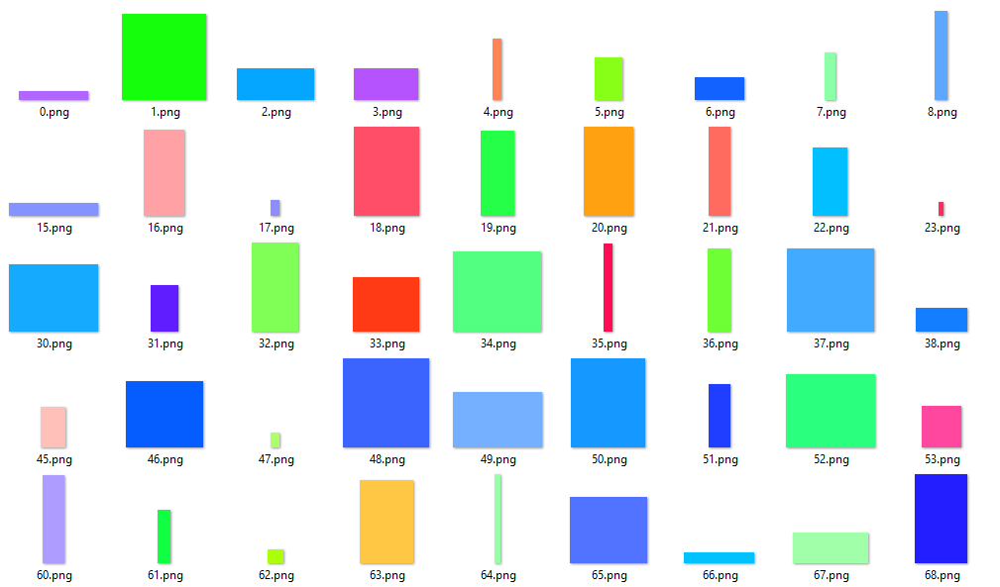
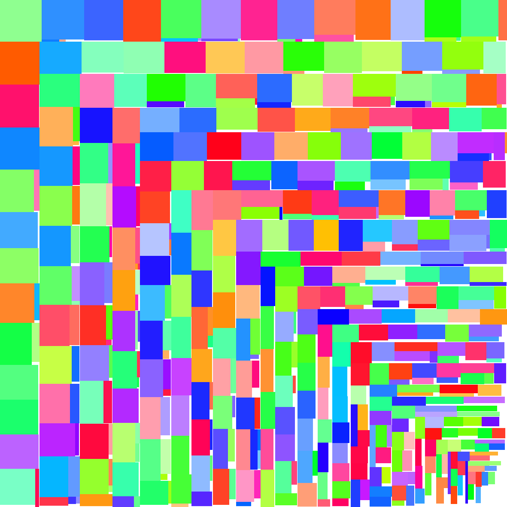
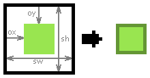

# TXPK - Texture Packer #

Highly configurable texture packer.

## Preview ##

Packing many random images with random size



into one single image



## How it works ##

The TXPK has a very large and complex command line interface to configure many properties.
I don't advise using it, but if you want to, [here][1] is a more detailed version how the CLI can be used.

The easiest way to use the TXPK is to let it generate a project file. This can be done via the command line:
`>txpk.exe -g`

This will generate a default `.txpk` project file which is nothing more than a `.json` file and looks like this:

```json
{
	"recursiveFiles" : false,
	"inputDirectory" : "",
	"inputRegex" : ".+((.png)|(.jpg)|(.jpeg))$",
	"scriptDirectory" : "",
	"outputImageDirectory" : "",
	"outputDataDirectory" : "",
	"outputName" : "txpk_export",
	"outputImageFormat" : "png",
	"packingAlgorithm" : "Default",
	"dataExportAlgorithms" : [
		"Default"
		],
	"keyConversionAlgorithm" : "Default",
	"allowRotation" : false,
	"sizeConstraint" : 0,
	"constraintType" : 0,
	"clearColor" : "0",
	"trimImages" : false,
	"replaceSameTextures" : false
}
```

The project file has the same properties as the CLI. But is easier to use. 

You can use the CLI to load the project: `>txpk.exe -p"path/to/project.txpk"`

The first CLI argument is implemented as a positional argument for the project.
This allows you to just write: `>txpk.exe "path/to/project.txpk"`.

Or you can just drop the project file onto the `txpk.exe` file.

## But what are all these properties? ##

- `recursiveFiles`: whether the images should be searched recursively in the input directory or not.
- `inputDirectory`: the directory where to search the images.
- `inputRegex`: the regular expression to filter you images. You could actually allow every file (even non image files). The TXPK will report errors while loading.
- `scriptDirectory`: the directory where the TXPK will look for any Lua script files.
- `outputImageDirectory`: the directory where to put the packed resulting image.
- `outputDataDirectory`: the directory where to put any data file which are generated by data export algorithms.
- `outputName`: the name all data files will have.
- `outputImageFormat`: the format in which the resulting packed image will be saved as. Currently only `.png`, `.jpg`/`.jpeg` are supported. 
- `packingAlgorithm`: the algorithm to pack the input textures with. You can use the CLI to learn more about which packing algorithms are supported: `>txpk.exe -h`. In the current version there are only two different packers `SameSize` and `Blackspawn` (named after and inspired by [jimscott][2]). `Default` is the `Blackspawn` packer. The detailed explanation for each packing algorithm can be found [here][3].
- `dataExportAlgorithms`: none or more algorithms which can export data related to the packing process. `Default` exporter is the `Json` exporter, which exports the positions and sizes of the textures. Detailed explanation of any exporter can be found [here][4].
- `keyConversionAlgorithm`: algorithm which converts the path/name of the texture to a key. `Default` is the `FileWithoutExt` converter which returns only the file name without extension. Detailed explanation of any key converter can be found [here][5].
- `allowRotation`: whether the packing algorithm is allowed to rotate images or not. Visualized [here](#TextureRotation).
- `sizeConstraint`: constrains the size of either width or height of the packed image.
- `constraintType`: `None=0`, `Width=1`, `Height=2`. The `sizeConstraint` will be ignored if the type is `None`.
- `clearColor`: the color to clear the resulting image with. Default is 0 (transparent black) which could also be written as `00000000` or `0x00000000`. This number should represent a hexadecimal number. `ff0000ff` would clear the packed image with red.
- `trimImages`: if this option is enabled, any excess transparency will be cut at the texture borders. Visualized [here](#TextureTrimming).
- `replaceSameTextures`: this option removes every redundant image. This will be done after trimming the textures and can result in a smaller packed texture. Let's say you have an animation of a ball jumping up and down. There are probably some frames where the ball is slightly below the ball one frame earlier. After trimming they are mostly all on the same level, so it's the same texture, so they will all be replaced with one. An example can be found [here][6].

### <a name="TextureTrimming"></a> Texture Trimming ###



The `ox` is the offset in x direction. This is a result of the source texture being trimmed on the left side. Same with the `oy` being the offset in y direction. The `sw` (source width) and `sh` (source height) are there so you can do stuff like moving the origin of the source texture to the center which would be impossible without knowing how large the texture was before.
This data is hold by any texture. The texture still has the current `x`, `y`, `width` and `height`. These are the four you need to crop the image. The data can be exported by any exporter and for example the [JsonExporter][14] does exactly that.

### <a name="TextureRotation"></a> Texture Rotation ### 

![rotation][7]

This `gif` shows exactly whats happening when an image gets rotated. It gets rotated by 90° counter clockwise. If you wanted to crop and load the texture you had to rotate it back 90° clockwise. If not changed, the rotation point is by default in the upper left corner. So when importing the texture you have to rotate it and have to adjust the position because the rotation point is different. You can look at the [example][6] for more insight.

### How to import packed textures containing rotated and trimmed images? ###
Please have a look at the [example][6].

### Did you just say Lua scripts? ###
The [LuaExporter][9] is able to load lua scripts so you can define custom exporters. More about the small scripting API can be found [here][4] and an example implementation can be found [here][10]. If you have created a valid lua script file you can add the file name without extension as an exporter in your project file. See the [example][11] for more insights.

### I just want to pack my same sized textures in one image without any extras ###
Ok let's assume you have these 64x64 images with a lot of unnecessary transparency:

![sgb_unpacked][12]

And you just want them to be packed in that order without trimming, rotating, replacing or whatever.
You can use the following project file:

```json
{
  "recursiveFiles": false,
  "inputDirectory": "",
  "inputRegex": ".+(.png)$",
  "scriptDirectory": "",
  "outputImageDirectory": "",
  "outputDataDirectory": "",
  "outputName": "sgb",
  "outputImageFormat": "png",
  "packingAlgorithm": "SameSize",
  "dataExportAlgorithms": [ ],
  "keyConversionAlgorithm": "",
  "allowRotation": false,
  "sizeConstraint": 0,
  "constraintType": 0,
  "clearColor": "0",
  "trimImages": false,
  "replaceSameTextures": false
}
```

Notice how `inputDirectory` and `outputImageDirectory` are not set. This can only work if the project file is in the same directory.
Also notice the `SameSize` packing algorithm.
This project outputs a `sgb.png` in the same directory which looks like this:

![sgb][13]


## External ##

- [Catch2][18] used for unit testing.
- [dirent][16] used for cross platform directory access.
- [stb_image][15] used for reading and writing images.
- [json][17] used for reading json files.
- [Lua][19] used for the Lua API.

## Build ##

This project uses [CMake][20] to generate platform and compiler-specific build files. Also note that this project uses `C++14` features 
such as `auto` and `lambdas` and therefore requires a `C++14` compliant compiler in order to build successfully.

1. Clone the repository
    ```
    git clone https://github.com/Seng3694/TXPK
    ```
2. Generate the build files
    ```
    mkdir bin
    cd bin
    cmake -G "Your Generator" ../TXPK
    ```
    With Visual Studio 2017 you could for example use "Visual Studio 15" or "Visual Studio 15 Win64" generators.
3. Build the files
    ```
    cmake --build . --config Release
    ```

Alternatively if you have python installed, you could just execute the `build.py` file in the root directory.

## License ##
This software is licensed under the MIT License. See [LICENSE][8] for more information.


[1]:app/CLI.md
[2]:http://blackpawn.com/texts/lightmaps/default.html
[3]:core/include/TXPK/Packers/PACKERS.md
[4]:core/include/TXPK/Exporters/EXPORTERS.md
[5]:core/include/TXPK/KeyConverters/KEYCONVERTERS.md
[6]:example/README.md
[7]:resources/texturerotation.gif
[8]:LICENSE
[9]:core/include/TXPK/Exporters/LuaExporter.hpp
[10]:example/content/scripts/CustomCppHeaderExporter.lua
[11]:example/content/txpk/skeleton.txpk
[12]:resources/sgb_unpacked.png
[13]:resources/sgb.png
[14]:core/include/TXPK/Exporters/EXPORTERS.md

[15]:https://github.com/nothings/stb
[16]:https://github.com/tronkko/dirent/blob/master/include/dirent.h
[17]:https://github.com/nlohmann/json
[18]:https://github.com/catchorg/Catch2
[19]:http://lua.org/
[20]:https://cmake.org/