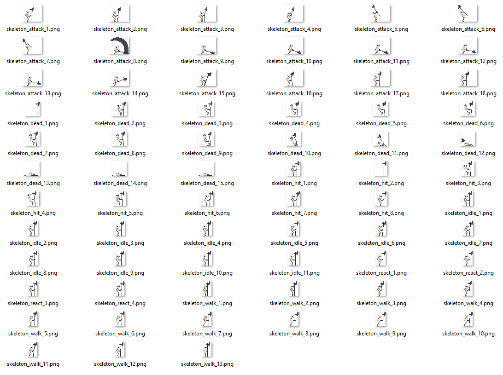
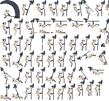

# TXPK - Example #

This example uses textures from [Jesse M.][1]

## Preparation ##

The content folder in this example was setupped like this:
```
content
|
|- meta
|
|- scripts
|   |- CustomCppHeaderExporter.lua
|   |- CustomEnumeratorKeyConverter.lua
|
|- sheets
|
|- sprites
|   |- textures...
|
|- txpk
    |- skeleton.txpk
```

The textures look like this:



The `skeleton.txpk` project file looks like this:

```json
{
  "recursiveFiles": false,
  "inputDirectory": "../sprites",
  "inputRegex": ".+(.png)$",
  "scriptDirectory": "../scripts",
  "outputImageDirectory": "../sheets",
  "outputDataDirectory": "../meta",
  "outputName": "skeleton",
  "outputImageFormat": "png",
  "packingAlgorithm": "Default",
  "dataExportAlgorithms": [
    "Json",
    "CustomCppHeaderExporter"
  ],
  "keyConversionAlgorithm": "CustomEnumeratorKeyConverter",
  "allowRotation": true,
  "sizeConstraint": 0,
  "constraintType": 0,
  "clearColor": "0",
  "trimImages": true,
  "replaceSameTextures": true
}
```

As you can see, the paths are all relative to each other. The packed texture will be saved to the `sheets` directory.
Every file created by any exporter will be saved in the `meta` directory. The output files will be called `skeleton.[file extension]`. 
The file extension is dependant on the exporter.

The default packing algorithm ([BlackspawnPacker][2]) will be used.

The [JsonExporter][3] and a custom CppHeader LuaExporter (which does exactly the same as the C++ counterpart. Reimplemented in Lua for showcase reasons) will be used.

A custom Enumerator LuaKeyConverter will be used to generate texture keys (does exactly the same as the C++ counterpart).

The textures are allowed to be rotated, trimmed and replaced if appropriate.

After running `TXPK.exe skeleton.txpk` the content tree looks like this:

```
content
|
|- meta
|   |- skeleton.hpp
|   |- skeleton.json
|
|- scripts
|   |- CustomCppHeaderExporter.lua
|   |- CustomEnumeratorKeyConverter.lua
|
|- sheets
|   |- skeleton.png
|
|- sprites
|   |- textures...
|
|- txpk
    |- skeleton.txpk
```

The header file looks like this:

```cpp
#define SKELETON_HIT_1 33
#define SKELETON_HIT_2 34
#define SKELETON_HIT_3 35
#define SKELETON_HIT_4 36
#define SKELETON_HIT_5 37
#define SKELETON_HIT_6 38
#define SKELETON_HIT_7 39
#define SKELETON_HIT_8 40
#define SKELETON_IDLE_1 41
#define SKELETON_IDLE_2 42
#define SKELETON_IDLE_3 43
#define SKELETON_IDLE_4 44
#define SKELETON_IDLE_5 45
#define SKELETON_IDLE_6 46
#define SKELETON_IDLE_7 47
#define SKELETON_IDLE_8 48
#define SKELETON_IDLE_9 49
#define SKELETON_IDLE_10 50
#define SKELETON_IDLE_11 51
#define SKELETON_REACT_1 52
#define SKELETON_REACT_2 53
#define SKELETON_REACT_3 54
#define SKELETON_REACT_4 55
```

Of course it starts at zero and goes way further. 

The json file:

```json
{
  "meta": {
    "w": 215,
    "h": 198,
    "img": "../sheets/skeleton.png"
  },
  "bin": [
    {
      "key": 0,
      "x": 68,
      "y": 36,
      "w": 32,
      "h": 22,
      "ox": 3,
      "oy": 5,
      "sw": 43,
      "sh": 37,
      "r": true
    },
    {
      "key": 1,
      "x": 132,
      "y": 36,
      "w": 32,
      "h": 22,
      "ox": 3,
      "oy": 5,
      "sw": 43,
      "sh": 37,
      "r": true
    },
    [...]
    ]
}
```

And the sheet:



## Import ##

The example uses [SFML 2.5][4].

The key part while importing is this function:

```cpp
CustomSprite Atlas::getSprite(int id) const
{
	//CustomSprite is a renderable, transformable which encapsulates 
	//another sprite in it to combine transforms before drawing because
	//the inner sprite has to be transformed here and should not be changed
	CustomSprite sprite;

	//subtextures are the texture informations which got loaded from the json file
	auto itr = subTextures.find(id);
	if (itr == subTextures.end())
		return sprite;

	const Texture& subTexture = itr->second;

	//set inner sprites texture to the whole atlas
	sprite.innerSprite.setTexture(texture);
	//set cropping rectangle/quad
	sprite.innerSprite.setTextureRect(sf::IntRect(subTexture.x, subTexture.y, subTexture.width, subTexture.height));

	if (subTexture.rotated)
	{
		//if the texture got rotated we have to rotate it back
		sprite.innerSprite.setRotation(90);
		//and adjust the position
		sprite.innerSprite.move(subTexture.height, 0);
	}

	//adjust the trimming offset
	sprite.innerSprite.move(subTexture.offsetX, subTexture.offsetY);
	
	//the custom sprite implementation holds the width and height so you can center the origin for rotation
	sprite.width = subTexture.sourceWidth;
	sprite.height = subTexture.sourceHeight;

	return sprite;
}
```

![txpk_import][5]

Basically the TXPK does step 1-3 and the code above reverses it with step 4-7.

For more detail please check out the source code.

To get the sprites in a vector you can use the keys in the exported header:

```cpp
std::vector<CustomSprite> attackSprites;
for(unsigned int i = SKELETON_ATTACK_1; i <= SKELETON_ATTACK_18; ++i)
    attackSprites.push_back(atlas.getSprite(i));
```

## Final Product ##

![skeleton_anim][6]

Simple animation with a slightly dark transparent rectangle to visualize the source texture size.
Because the animation duration is not synced with rotation speed and i cut the gif directly after 360� it looks kind of... choppy.


[1]:https://jesse-m.itch.io/skeleton-pack
[2]:../core/include/TXPK/Packers/PACKERS.md
[3]:../core/include/TXPK/Exporters/EXPORTERS.md
[4]:https://www.sfml-dev.org/index.php
[5]:../resources/txpk_export_import.gif
[6]:../resources/skeleton_animation.gif